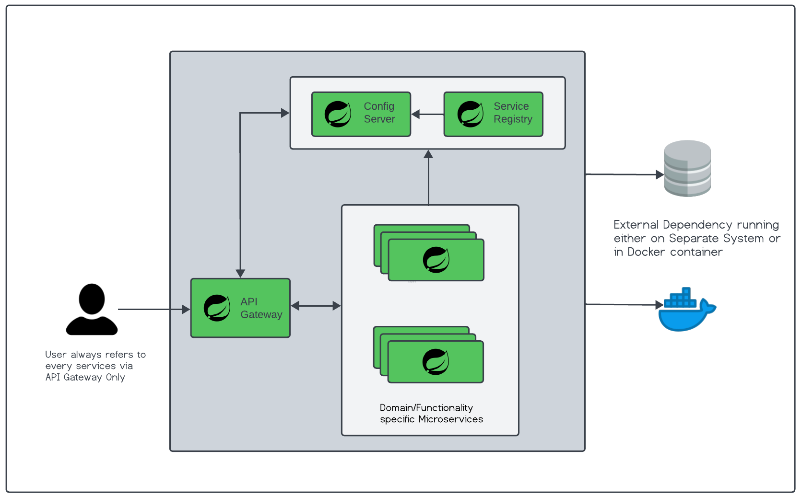

# Spring Boot + Spring Cloud Microservices
### Overview

This source code is based on Maven multi-module project, the parent project `gm-parent-pom` contains common 
maven configuration which can be shared with child module projects. This source code contains one library project named 
as `gm-commons-spring-boot-starter` which will contain modules or Spring components that can be reused by child modules. 
In addition to library project, we are having four Spring Boot application namely `configuration-svc`, 
`service-registry-svc`, `gateway-svc`, `greet-svc` each with their specific purpose and functionality which we will
discuss in below sections. We will be using `docker` to run our external tools like Database, Nginx Server and any component
which the application needs for its functionality wherever possible, scripts required for running docker containers or
docker compose stack can be found under `docker-compose-environments` folder. If you would like to verify REST API's you 
can use Postman collection available under `postman` folder. We will be using `Java 17`, `Spring Boot 3.X.X`,
`Spring Cloud 2022.0.4` in our sample application.

### Architecture

Below image shows high-level interaction of various application in microservices architecture. As shown below, we
can see there are certain services like Config Server, Service Registry, API Gateway are connected with every 
microservice, we term these microservices as Core Services, as these services provides base for implementing scalable 
and distributed microservices systems. The application only exposes API Gateway service to be accessible publicly, all
other services will run behind it. We will be exposing services which offers Domain/Business functionality to public via
API Gateway. All our services except API Gateway will be running in private mode, in addition to it we are also not going
to expose Config Server and Service Registry to public as those needs to be used internally. All our applications can access 
external infrastructure or docker based container services like Database, NoSQL Database by updating our configuration.

_PS: As we are running all our services on single machine we can access individual application exposed API using host 
and port number information. Exposing services publicly and private is achievable when deploying application on Cloud
environment using VM instances._

### Services

##### Configuration Server
`configuration-svc` module provides implementation of Configuration server using Spring Cloud Config server. By default
config server is backed by git repository but for our implementation we will using classpath and file based location to
keep things simpler. Under main `resources` folder of `configuration-svc` you can find folder of pattern `config-{profile}` 
which contains configuration for particular profile which is currently `local`. Under this folder you can see multiple yml
configuration files, `application.yml` file within this folder provides common configuration which can be shared across
all available services configuration, service specific additional configuration for particular services is provided 
by creating yml file with the application name which is derived from property `spring.application.name`. All services 
except `configuration-svc` service at the startup connects with configuration server to fetch their configuration, 
which profile configuration to be fetched can be specified by setting `spring.profiles.active` environment or program argument.

For more information your can refer [Spring-Cloud-Config](https://docs.spring.io/spring-cloud-config/docs/current/reference/html/)

##### Service Registry 

Service Registry as the name implies is the registry of services which are registered with our Eureka Service registry.
In simple terms, we can say service registry act as a phone book of registered services containing information like 
service name, hostname, port and IP address and so on. Our service registry application resides under `service-registry-svc` 
which uses Spring Netflix Eureka Server for implementation. Our service registry application also fetches its configuration on
startup from Configuration server.

For more information your can refer [Spring-Cloud-Eureka-Server](https://cloud.spring.io/spring-cloud-netflix/multi/multi_spring-cloud-eureka-server.html)

##### API Gateway

API Gateway is implemented using Spring Cloud Gateway instead of Spring Netflix Zuul Gateway. Spring Cloud Gateway is more
feature rich as compared with Zuul API Gateway. API Gateway is publicly exposed and is central point to access all our
microservices APIs. API Gateway on startup also fetches its configuration from Configuration server and uses Service
registry to locate the downstream services for forwarding the requests using their name. API Gateway can automatically 
maps downstream services using their service names as means of communicating with downstream service.

For more information your can refer [Spring-Cloud-Gateway](https://docs.spring.io/spring-cloud-gateway/docs/current/reference/html/#gateway-starter)

##### Greet Service

A Simple service exposing greet API to greet the provided username.

### Running Services

All application can be run as standalone java application, Configuration service must be run first as it provides configuration
for all other microservices, after running configuration service we need to run Service Registry application once these two
services started successfully other microservices can be run in any order.

#### References
- [Maven Multi-Module Project](https://books.sonatype.com/mvnex-book/reference/multimodule.html)
- [Maven Multi-Module Enterprise Project](https://books.sonatype.com/mvnex-book/reference/multimodule-web-spring.html)
